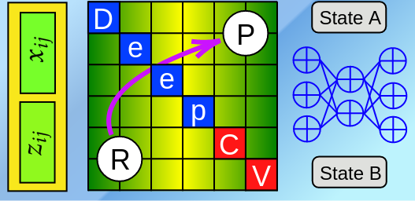

# Why DeepCV?

DeepCV is a deep learning framework for training a machine learning model on molecular representations to learn collective variables (CVs), reaction coordinates. DeepCV implements the so-called deep learning autoencoder neural network (DAENN) which makes use of the sophisticated symmetric feedforward multilayer perception to extract the latent space of the data and smartly generates non-linear CVs. Our algorithm also adopts a newly developed nuclear representation called eXtended Social PeRmutation INvarianT (xSPRINT) and applies the customization of loss function with the min-max game for smartly learning unexplored regions in configurational space. The recent work also shows that the DAENN can successfully learn a set of hidden CVs which capture slow-mode rare event corresponding to metastable states of studied chemical reactions. Moreover, metadynaics simulations using the DAENN CVs give accurate free energy surface (FES) of a set of chemical reactions, yielding accurate thermodynamic properties such as free energy of activations compared to other biasing methods and experimental values.

<figure markdown>
  { width="300" }
  <figcaption>DeepCV</figcaption>
</figure>
