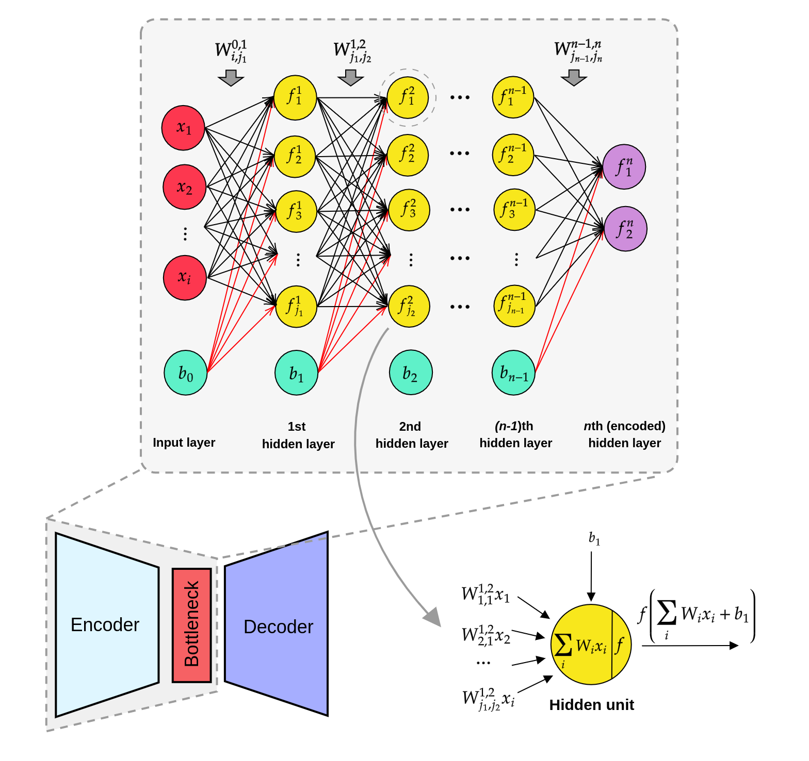

# Model and Descriptors

## DAENN model

<figure markdown>
  { width="600" }
  <figcaption>The architecture of encoder engine in DAENN</figcaption>
</figure>

## Descriptors for DAENN

DAENN is designed to train with (1) internal coordinates ([Z-matrix](https://en.wikipedia.org/wiki/Z-matrix_(chemistry))) and (2) SPRINT or xSPRINT coordinates:

1. Internal coordinates (bond distance, bond angle, bond torsion)
2. Social PeRmutation INvarianT (SPRINT) coordinates and extended SPRINT (xSPRINT) coordinates

xSPRINT is an efficient molecular representation developed on top of [SPRINT](https://journals.aps.org/prl/abstract/10.1103/PhysRevLett.107.085504) by including structural information of neighboring atoms. Details of xSPRINT is provided in our paper: https://pubs.acs.org/doi/full/10.1021/acs.jpclett.1c04004.

Moreover, DAENN model can be trained using features generated by any descriptors which can serve unsupervised machine learning model.
