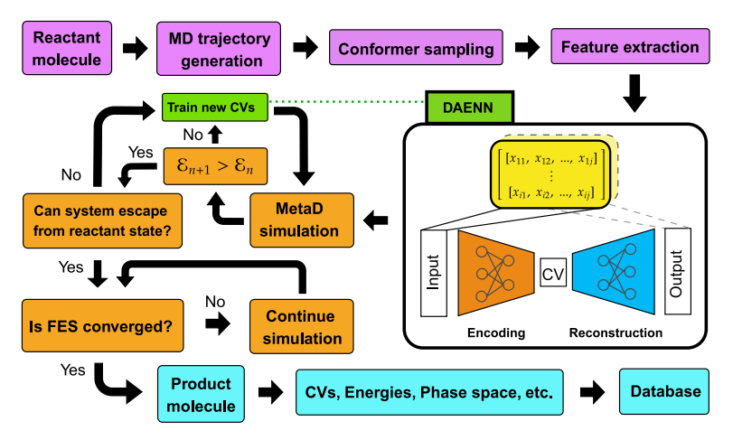

# Understand how DeepCV works

To help the users easily understand the whole procedure of DAENN we provide an end-to-end workshop pipeline of DAENN below. The process starts from the step where we use unbiased molecular dynamics to generate a trajectory of reactant conformers. Then it proceeds to feature calculation, model training, and CV generation, respectively. The trained CVs are then used as input for metadynamics simulation (or any other enhanced sampling methods) to calculate free energy surfaces (FESs) of a studied chemical system.

<figure markdown>
  { width="1200" }
  <figcaption>A complete workflow of DAENN and FES reconstruction.</figcaption>
</figure>
