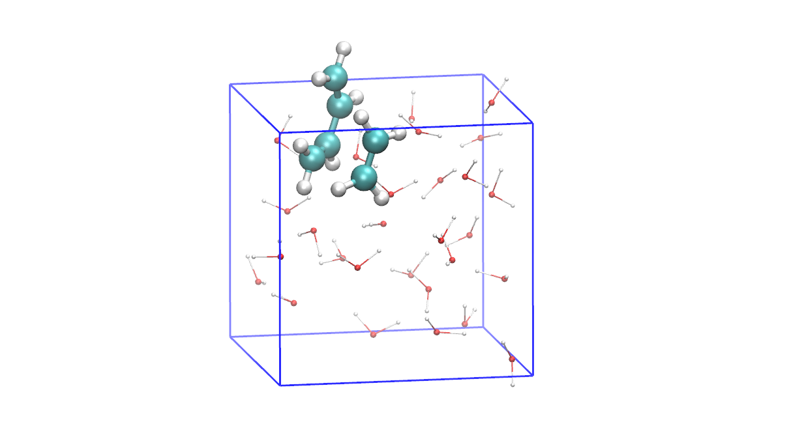

# Prepare dataset

First step prior to calculation of representation is to generate a trajectory of reactant conformers; 
this can be done using (unbiased) molecular dynamics (MD) simulation. 
We recommend general MD packages, e.g., [CP2K](https://www.cp2k.org/), [GROMACS](https://www.gromacs.org/), [LAMMPS](https://www.lammps.org/), or any software that supports [PLUMED](https://www.plumed.org/), which is a plugin for running metadynamics simulation.

<figure markdown>
  { width="1200" }
  <figcaption>Ethene and 1,3-butadiene in water (reactant of Diels-Alder reaction). The box size is 8.964321 x 8.964321 x 8.964321 Angstroms^{3}.</figcaption>
</figure>

```sh
$ ls
traj.xyz
```

Coordinates of the Diels-Alder reaction's reactants (water molecules are removed).
```sh
$ less traj.xyz
 16
 8.964321 8.964321 8.964321
 C         2.430478        7.701602        5.168173
 C         1.681471        7.470311        6.245923
 C         3.060065        7.178442        8.580067
 C         3.473648        8.476497        8.540420
 C         2.603304       10.157928        5.590882
 C         2.924473        9.043101        4.926539
 H         2.737233        6.932679        4.545779
 H         1.141304        8.068218        6.905137
 H         2.058858        6.902197        9.062827
 H         2.914139        9.373862        8.811097
 H         1.896734       10.304312        6.395830
 H         3.657252        9.144499        4.106499
 H         3.010528       11.097670        5.178681
 H         4.396297        8.612995        8.046517
 H         3.734648        6.372926        8.296480
 H         1.332488        6.508595        6.561897
...
...
...
```

## Calculate molecular representations and generate input files (dataset) for neural network

`calc_rep` module calculates all molecular representations (feature vectors) needed to train DAENN model. 
The dataset of each feature is saved in `.npz` file format.

### 1. Z-matrix (internal coordinate)

Calculate bond distance, bond angle, and dihedral angle (torsion), and save .npz separately.

The following example calculates the features using only all carbon atoms (index 1, 2, 3, 4, 5, 6).

```sh
$ deepcv/src/main.py calc_rep --input traj.xyz --atom-index {1..6} --rep zmat --save
Converting text data to NumPy array...
Shape of NumPy array: (50, 16, 3)
List of atom indices: [1, 2, 3, 4, 5, 6]
Shape of NumPy array with only specified atom index: (50, 6, 3)
Calculate distance coordinates of all structures
Calculate bond angle coordinates of all structures
Calculate torsion angle coordinates of all structures
```

### 2. SPRINT and xSPRINT coordinates

- SPRINT coordinates

```sh
$ deepcv/src/main.py calc_rep --input traj.xyz --atom-index {1..6} --rep sprint --save
Converting text data to NumPy array...
Shape of NumPy array: (50, 16, 3)
List of atom indices: [1, 2, 3, 4, 5, 6]
Shape of NumPy array with only specified atom index: (50, 6, 3)
Calculate SPRINT coordinates and sorted atom index
```

- xSPRINT coordinates

```sh
$ deepcv/src/main.py calc_rep --input traj.xyz --atom-index {1..6} --rep xsprint --save
Converting text data to NumPy array...
Shape of NumPy array: (50, 16, 3)
List of atom indices: [1, 2, 3, 4, 5, 6]
Shape of NumPy array with only specified atom index: (50, 6, 3)
Calculate xSPRINT coordinates and sorted atom index
```

### Check files

```sh
$ ls *.npz
traj-dist.npz
traj-angle.npz
traj-torsion.npz
traj-sprint.npz
traj-xsprint.npz
```
